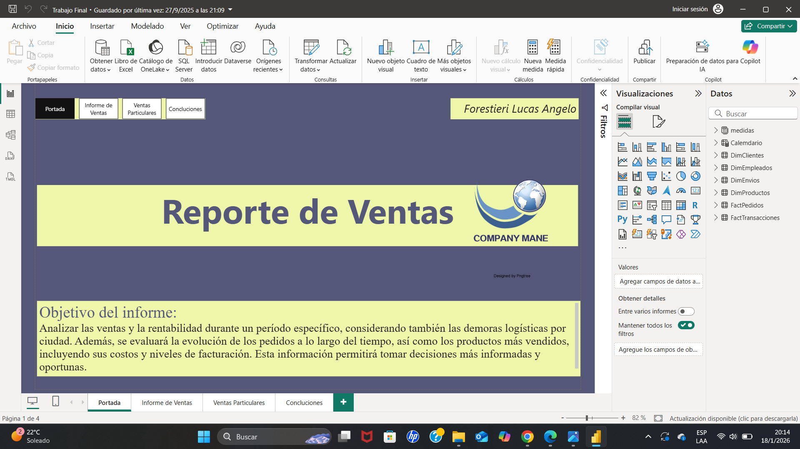
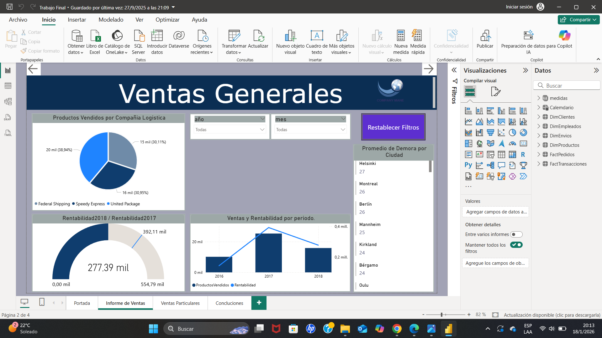
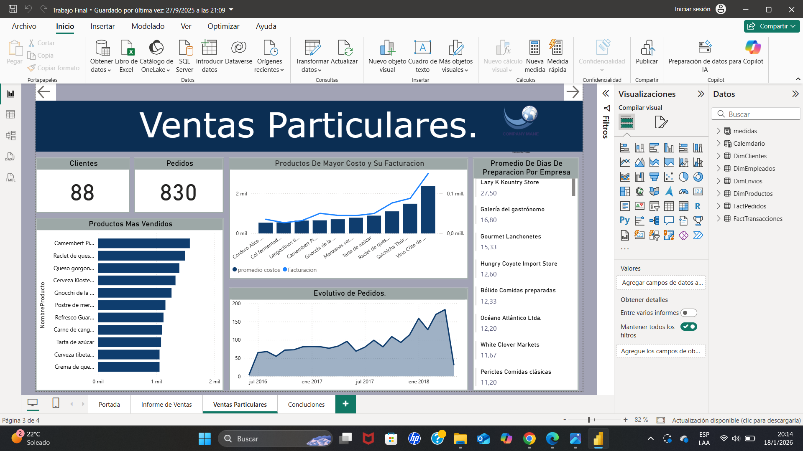
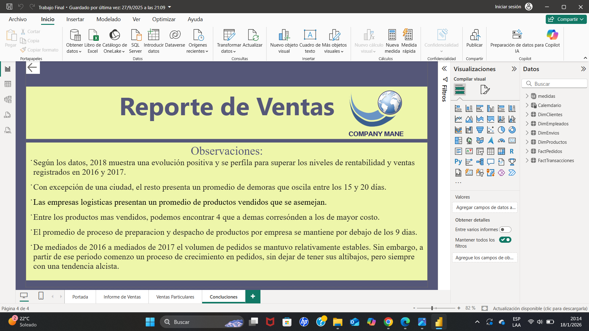

# 📊 Proyecto de Análisis de Datos – Power BI

Este proyecto consiste en el desarrollo de un dashboard interactivo en Power BI para analizar un conjunto de datos y obtener información relevante para la toma de decisiones.

## 🎯 Objetivo

Analizar un conjunto de datos para identificar tendencias y patrones relevantes, permitiendo visualizar información clave y facilitar la toma de decisiones a partir de datos.

## 🔧 Herramientas utilizadas

- Power BI  
- Excel  

## 📈 Análisis realizado

- Análisis general de los datos  
- Identificación de tendencias  
- Creación de KPIs  
- Visualización interactiva de la información  

## 📊 Principales insights

- Identificación de tendencias y comportamientos dentro del dataset  
- Detección de métricas clave (KPIs) relevantes para el análisis  
- Visualización de datos que permite interpretar la información de forma clara y rápida  

## 📊 Dashboard

